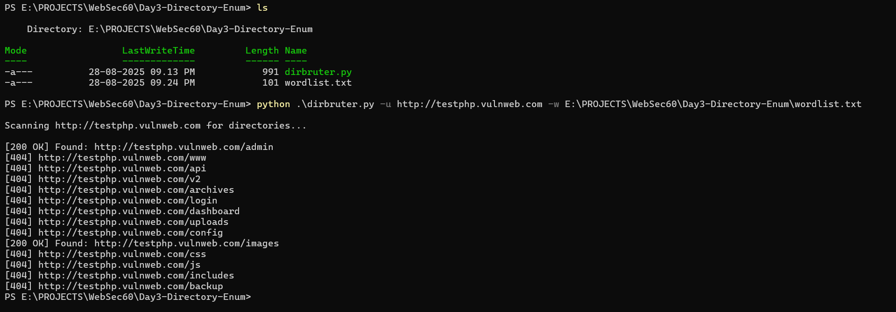

# Directory Brute Forcer

A basic Python script that scans a target website for common directories using a wordlist and checks HTTP status codes.

## Features
- Reads directory names from a wordlist
- Sends HTTP requests to each path
- Displays status codes (e.g., 200 OK, 404 Not Found)

## Requirements
- Python 3.x
- `requests` library (`pip install requests`)

## Usage

```bash
python dirbruter.py -u http://example.com -w wordlist.txt
```

